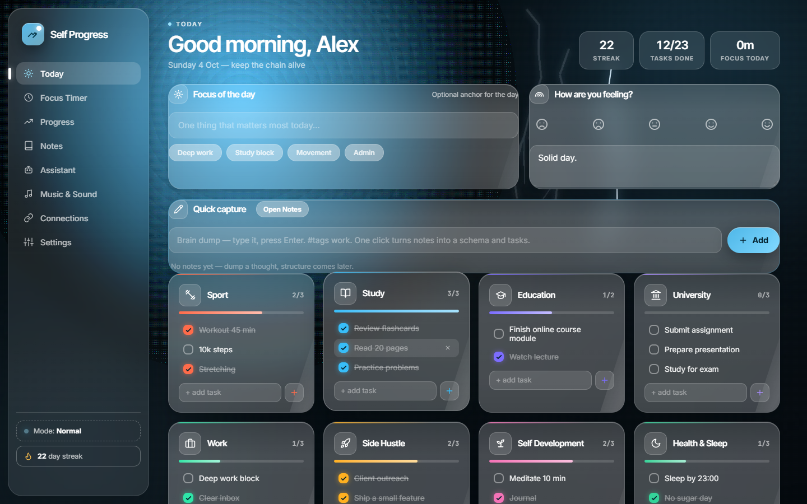
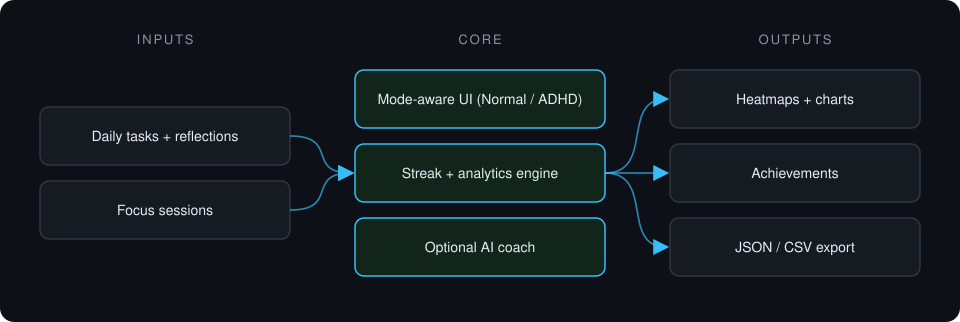
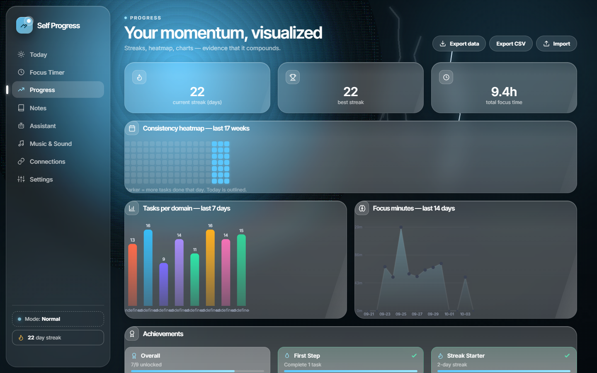
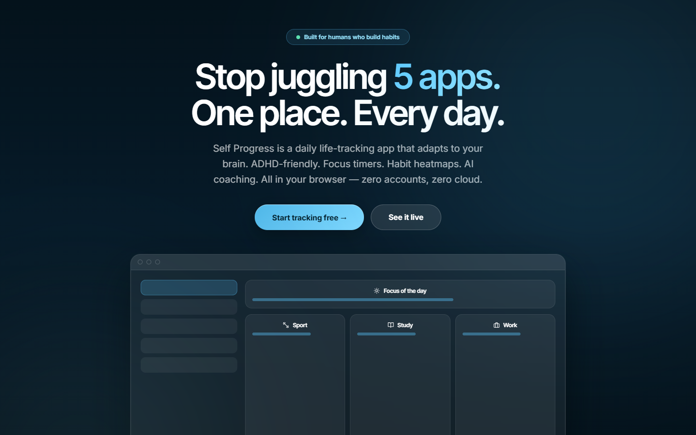

# Self Progress

**Daily life-tracking app with Normal and ADHD modes: per-domain checklists, focus timer, progress analytics and an optional AI coach.**

> **This is a proprietary project. Source code is private. This page showcases the system's architecture and results.**

**Case study page:** [https://jryahia.github.io/showcase-self-progress/](https://jryahia.github.io/showcase-self-progress/)

## Problem it solves

Habit and productivity apps rarely adapt to how different people focus. Self Progress tracks every area of life in one place and switches layout, timer and coaching style between a full dashboard and an ADHD-friendly mode.

## Architecture

1. Onboarding picks a mode and life domains.
2. Daily checklists, mood and reflections are logged per domain.
3. Focus sessions feed streaks, heatmaps and charts.
4. Data stays in the browser, with export and import for backup.

## Key features

- Normal and ADHD modes
- Per-domain daily checklists
- Pomodoro focus timer
- 17-week consistency heatmap
- Optional OpenAI-compatible AI coach
- No server: runs from a single file

## Tech stack

   

## What it does in practice

- Runs fully offline with zero accounts; the user owns the data.

## Screenshots

> Screenshots show the app running on seeded demo data, not client data.

**Today view**

**Progress analytics**

**Landing**

---

Built by [Yahya Jarray](https://github.com/jryahia). Interested in a similar system? [Get in touch](mailto:yahiajarray43@gmail.com).

This repository contains no source code. It is a case study for a proprietary project. © Yahya Jarray.
